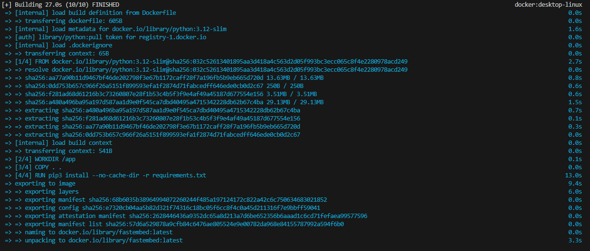
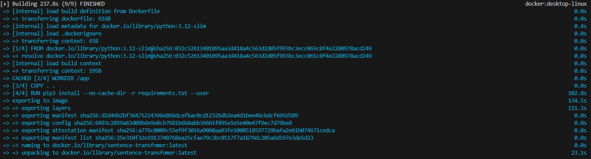
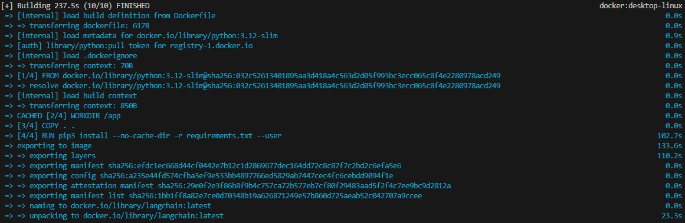

# dockerize-torch-fastembed-sentence-transformer-comparison
This is a comparison between torch fastembed and sentence-transformer. The goal is to see what is the best in order to save space for creating a docker image.

Of course we expect that torch will be the heaviest one and also sentence transformer so we are going to use three different environments in conda to not get in conflict with each other.

PYTHON VERSION: 3.12.4
CONDAENVS:
1. fastembed
2. sentence
3. langchain

```
conda create -n fastembed -y
conda create -n sentence -y
conda create -n langchain -y
```
```
conda activate fastembed
conda activate sentence
conda activate langchain
```

We expect also that each library will create a list of float (or numpy.float32) for each sentence and each list should contain 384 items.

## Fastembed

### Libraries
--user cause i had trouble reading a file
```
pip3 install --no-cache-dir fastembed --user
```

There is a problem with ONNX so we needed to downgrade to v.1.19 see [requirements](./fastembed/requirements.txt)

### Build time


### Image size


## Sentence transformer

### Libraries
```
pip install sentence-transformers --user
```

### Build time


### Image size


## Lanchain

### Libraries
```
pip install langchain_huggingface --user
```

### Build time


### Image size


## Finale

### Results 
| name | build time (s) | image size (GB) |
|-----|------|-----|
| fastembed | 27 | 0.6 |
| sentence-transformer | 237.8 | 9.21 |
| langchain | 237.5 | 9.24 |

### Consideration
Because sentence-transformer uses torch I decided not to carry on with implementing the torch part (old school Automodel and AutoTokenizer). Langchain library was tested and had the same result with same culprit: the torch library (we can see in the results that the docker image are almost the same). The margin we get by using ONNX is enourmous when building images and it allow to save memory and build time for CI/CD pipelines. If you know other methods feel free to contribute.
